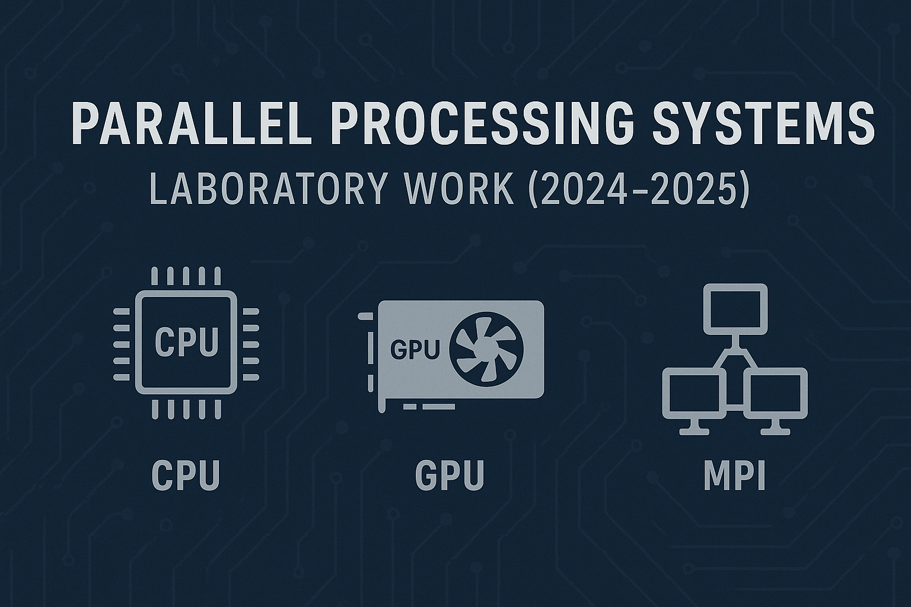

# Parallel Processing Systems – Laboratory Work (2024–2025)



<p align="center">

<table align="center">
  <tr>
    <td align="center" style="padding: 0 20px;">
      <br/>
      <b>OpenMP</b>
    </td>
    <td align="center" style="padding: 0 20px;">
      <br/>
      <b>MPI</b>
    </td>
    <td align="center" style="padding: 0 20px;">
      <br/>
      <b>CUDA</b>
    </td>
  </tr>
</table>

</p>


[](https://en.wikipedia.org/wiki/C_(programming_language))
[](https://www.openmp.org/)
[](https://www.mpi-forum.org/)
[](https://developer.nvidia.com/cuda-zone)

## 📖 Overview

This repository presents the **implementations, performance evaluations, and analytical reports** developed for the course:

> **Parallel Processing Systems**<br>
> School of Electrical and Computer Engineering, NTUA<br>
> Academic Year **2024–2025**

The work goes beyond basic solutions. Each lab is approached as a **in-depth experimental study**, integrating:

- Multiple **parallelization strategies** per algorithm (naive, optimized, NUMA-aware, GPU-accelerated, MPI-based).
- Systematic **profiling and benchmarking** with performance counters and memory bandwidth tools.
- **Comparative studies** across architectures (shared-memory vs GPU vs distributed-memory).
- **Scalability analysis** and performance **bottleneck investigation**

The repository demonstrates a progression from **introductory parallelization** to **high-performance optimization and scalability evaluation**.

## 📂 Repository Structure

```
.
├── assignment1/                   # Game of Life (OpenMP): locality, false sharing, scalability
├── assignment2/                   # Shared-memory: K-means (naive/reduction/NUMA-aware), locks, Floyd-Warshall (tiled), concurrent lists
├── assignment3/                   # GPU: CUDA K-means (naive, transpose, shared memory, all-GPU, delta reduction)
├── assignment4/                   # Distributed-memory: MPI K-means + 2D Heat Diffusion (Jacobi, GS-SOR, RB-SOR)
├── pps_exercises_2024_2025.pdf    # Official lab assignment descriptions
├── report.pdf                     # Final report with measurement data, plots, and analyses.
├── LICENSE                        # License information
└── README.md                      # Repository overview
```

## 🖥️ Laboratory Highlights

### **1. Game of Life (OpenMP on Multicore CPUs)**
- **Parallelization Strategy**: Static scheduling for spatial locality, reduced false sharing.
- **Scalability Insights**:
  - Small grids → cache contention limits speedup.
  - Medium grids (1024×1024) → near-ideal scaling.
  - Large grids (4096×4096) → saturated by memory bandwidth, validated with **STREAM benchmark**.
- **Additional Work**: Implemented and visualized well-known Game of Life patterns (Gliders, Pulsar, Gosper Gun).

### **2. Shared-Memory Architectures (OpenMP & Synchronization)**
- **K-means Clustering**:
  - Implemented **naive**, **reduction-based**, and **NUMA-aware allocation** approaches.
  - Identified why naive scaling collapses beyond 8 threads (NUMA + atomic contention).
  - Reduction + NUMA-aware version achieved ~27× speedup on 32 cores.
- **Lock Mechanisms**:
  - Benchmarked `pthread_mutex`, spinlocks, TAS, TTAS, CLH, and more.
  - Compared latency, contention resilience, and fairness across loads.
- **Floyd–Warshall Algorithm**:
  - Implemented task-parallel and **tiled versions**.
  - Analyzed why naive parallelization stalls due to cache and synchronization costs.
- **Concurrent Linked Lists**:
  - Compared five synchronization schemes (coarse/fine-grain, optimistic, lazy, non-blocking).
  - Measured throughput differences under concurrent workloads.

### **3. GPU Programming (CUDA Acceleration of K-means)**
- Developed **five GPU variants**:
  1. Naive kernel offload
  2. Transposed memory layout (coalesced accesses)
  3. Shared memory optimization
  4. All-GPU execution (including centroid updates)
  5. All-GPU + Delta reduction (bonus)
- **Advanced Analysis**:
  - Tuned **block sizes** with `cudaOccupancyMaxPotentialBlockSize`.
  - Conducted **cross-configuration comparisons** (clusters × dimensions).
  - Identified **compute vs memory bottlenecks**, showing why shared memory significantly improves performance.

### **4. Distributed-Memory Architectures (MPI)**
- **MPI K-means**:
  - Parallelized centroid updates across processes with communication.
  - Benchmarked scalability up to 64 processes.
  - Compared distributed vs shared-memory versions.
- **2D Heat Diffusion (PDE Solver)**:
  - Implemented **Jacobi, Gauss–Seidel SOR, and Red–Black SOR** methods.
  - Ran both **fixed iteration counts** and **convergence-based executions**.
  - Analyzed trade-offs between **convergence speed** and **parallel efficiency**.
- **Scaling Results**:
  - **Strong scaling**: showed diminishing returns due to communication overhead.
  - **Weak scaling**: quantified efficiency loss with growing process count.

## ⚙️ Tools & Environment

- **Languages**: C, CUDA
- **Frameworks**: OpenMP, MPI, CUDA
- **Profiling Tools**: `likwid-perfctr`, STREAM benchmark
- **Hardware Platforms**:
  - NTUA CSLab clusters (`sandman`, `silver1`, `clones`)
  - NUMA Xeon CPUs (64 hardware threads)
  - NVIDIA CUDA-enabled GPUs

## 📊 Scalability and Performance Analysis

Each assignment includes:
- Raw benchmark data
- Execution time and **scalability plots**
- Comparison across **multiple programming models**
- Detailed **bottleneck identification** (cache limits, NUMA latency, memory bandwidth, inter-node communication)

## 📝 Notes

- This repository is intended for **educational and research purposes**.
- The implementations emphasize **performance engineering**, not just correctness.
- Results may vary depending on the hardware configuration and cluster environment.

---

Copyright © 2025 Andreas Stamos. All rights reserved.
